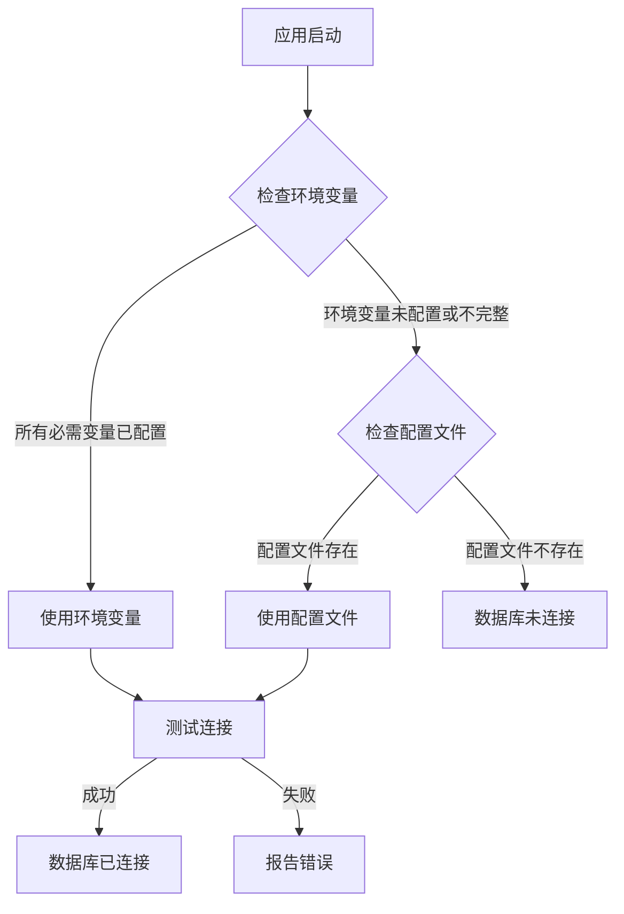

# 数据库配置优先级说明

## 📊 配置读取优先级

系统按照以下优先级读取数据库配置：

### 优先级1：环境变量（最高优先级）

**检查条件**：所有必需的环境变量都已配置

**必需的环境变量**：
- `DB_HOST` ✅
- `DB_NAME` ✅
- `DB_USER` ✅
- `DB_PASSWORD` ✅

**可选的环境变量**：
- `DB_PORT`（默认：3306）

**示例**：
```bash
export DB_HOST=ts708yr65368.vicp.fun
export DB_PORT=33787
export DB_NAME=newwork
export DB_USER=root
export DB_PASSWORD=abcABC123
```

**优先级原因**：
- ✅ 生产环境标准配置方式
- ✅ 不暴露密码到代码仓库
- ✅ 便于动态修改（无需重新部署代码）
- ✅ 符合 12-Factor App 原则

### 优先级2：配置文件（.db-config.json）

**检查条件**：环境变量未配置或不完整

**配置文件位置**：`/workspace/projects/.db-config.json`

**示例**：
```json
{
  "id": "default-config",
  "name": "默认配置",
  "type": "mysql",
  "host": "ts708yr65368.vicp.fun",
  "port": 33787,
  "databaseName": "newwork",
  "username": "root",
  "password": "abcABC123",
  "isActive": true,
  "isDefault": true
}
```

**使用场景**：
- ⚠️ 开发环境（临时配置）
- ⚠️ 环境变量未配置时的降级方案
- ❌ 不推荐用于生产环境（密码暴露在文件中）

### 优先级3：无配置（最低优先级）

**结果**：数据库未连接

**影响**：
- ❌ 数据库功能不可用
- ⚠️ oneAPI 无法使用
- ⚠️ 用户数据无法持久化

## 🔄 配置读取流程



## 💻 代码实现

### 环境变量检查逻辑

```typescript
// src/lib/app-initializer.ts

const envDbConfig = {
  host: process.env.DB_HOST,
  port: parseInt(process.env.DB_PORT ?? '3306'),
  username: process.env.DB_USER,
  password: process.env.DB_PASSWORD || '',
  databaseName: process.env.DB_NAME,
};

// 检查环境变量是否完整
if (envDbConfig.host && envDbConfig.databaseName && envDbConfig.username) {
  console.log('[Initialize] ✅ 环境变量配置完整，使用环境变量连接...');
  await dbManager.connect({
    id: 'env-config',
    name: '环境变量配置',
    type: 'mysql',
    host: envDbConfig.host,
    port: envDbConfig.port,
    username: envDbConfig.username,
    password: envDbConfig.password,
    databaseName: envDbConfig.databaseName,
    isActive: true,
    isDefault: true,
    createdAt: new Date(),
    updatedAt: new Date(),
  });
  return;
}

console.log('[Initialize] ⚠️ 环境变量配置不完整，检查配置文件...');
```

### 配置文件回退逻辑

```typescript
// src/lib/app-initializer.ts

const fileConfig = loadConfigFromFile();

if (fileConfig) {
  console.log('[Initialize] ✅ 检测到配置文件，使用配置文件连接...');
  await dbManager.connect(fileConfig);
  return;
}

console.log('[Initialize] ❌ 未找到有效的数据库配置');
```

## 🚨 重要注意事项

### 1. 环境变量优先级保证

**问题**：配置文件可能包含旧密码

**解决**：
- ✅ 环境变量优先级高于配置文件
- ✅ 如果环境变量配置完整，不会读取配置文件
- ✅ 确保生产环境使用环境变量

### 2. 配置文件不应提交到 Git

**问题**：密码暴露在代码仓库

**解决**：
```bash
# .gitignore
.db-config.json
.env
.env.local
.env.*.local
```

### 3. 开发环境 vs 生产环境

| 环境 | 推荐配置方式 | 原因 |
|------|------------|------|
| 开发环境 | `.env.local` 或 配置文件 | 便于快速配置和测试 |
| 生产环境 | 环境变量 | 安全、可动态修改 |

### 4. 环境变量更新生效

**问题**：修改环境变量后不生效

**解决**：
- ⚠️ 环境变量在应用启动时读取
- ⚠️ 修改环境变量后需要**重启应用**
- ✅ 部署平台会自动注入环境变量

## ✅ 最佳实践

### 生产环境

1. **使用环境变量配置数据库**
   ```bash
   # Coze 平台配置
   DB_HOST=ts708yr65368.vicp.fun
   DB_PORT=33787
   DB_NAME=newwork
   DB_USER=root
   DB_PASSWORD=abcABC123
   ```

2. **删除配置文件中的敏感信息**
   ```bash
   rm .db-config.json
   ```

3. **更新 .gitignore**
   ```bash
   echo '.db-config.json' >> .gitignore
   echo '.env' >> .gitignore
   echo '.env.*.local' >> .gitignore
   ```

4. **验证环境变量**
   ```bash
   curl http://localhost:5000/api/debug/env
   ```

### 开发环境

1. **使用 .env.local 文件**
   ```bash
   # .env.local
   DB_HOST=localhost
   DB_PORT=3306
   DB_NAME=future_office_dev
   DB_USER=root
   DB_PASSWORD=dev_password
   ```

2. **不提交到 Git**
   ```bash
   echo '.env.local' >> .gitignore
   ```

3. **提供示例配置**
   ```bash
   # .env.example
   DB_HOST=localhost
   DB_PORT=3306
   DB_NAME=future_office_dev
   DB_USER=root
   DB_PASSWORD=your_password
   ```

## 📝 配置检查清单

- [ ] 生产环境使用环境变量配置数据库
- [ ] 环境变量名称正确（区分大小写）
- [ ] 所有必需的环境变量都已配置
- [ ] 配置文件（.db-config.json）已删除或移除敏感信息
- [ ] .gitignore 已更新，排除敏感文件
- [ ] 应用重启后环境变量生效
- [ ] 验证数据库连接成功
- [ ] 验证 oneAPI 配置加载成功

## 🔍 故障排查

### 问题：使用了错误的配置

**症状**：数据库密码错误

**原因**：
- 环境变量未配置
- 系统回退到配置文件
- 配置文件包含旧密码

**解决**：
1. 检查环境变量是否配置：`/api/debug/env`
2. 确保环境变量完整
3. 重启应用
4. 验证使用的是环境变量还是配置文件

### 问题：环境变量不生效

**症状**：
```json
{
  "environment": {
    "DB_HOST": null
  }
}
```

**原因**：
1. 环境变量未配置
2. 应用未重启
3. `.coze` 文件包含空值

**解决**：
1. 检查部署平台的环境变量配置
2. 重启应用
3. 检查 `.coze` 文件

---

**总结**：
- ✅ 环境变量优先级最高
- ✅ 生产环境应使用环境变量
- ✅ 配置文件仅用于开发环境
- ✅ 修改环境变量需要重启应用
